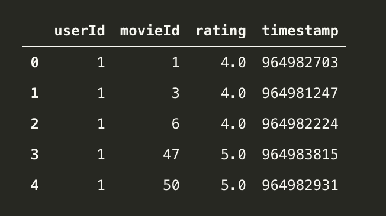
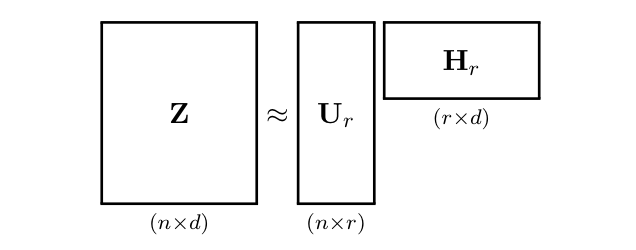
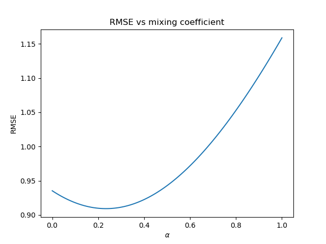
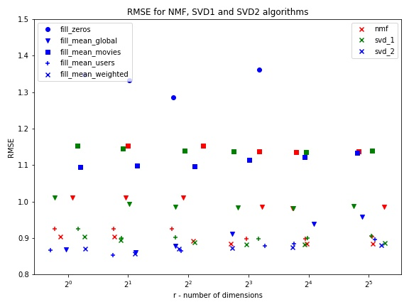
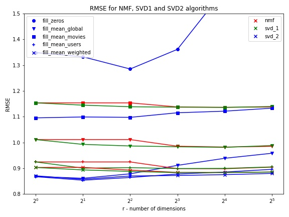
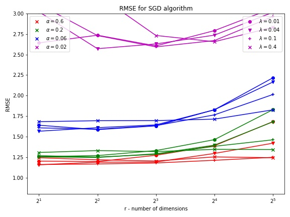

# Methods of classification and Dimensionality reduction. Project #1.

1st project as a part of '_Methods for classification and dimensionality reduction_' course's laboratory @ University of Wrocław by Authors:

- Bartosz Brzoza
- Jakub Michałowski

## Table of contents

- [Introduction](#Introduction)
- [Definition of the project's problem](#Definition-of-the-project-problem)
- [Technologies used](#Technologies-used)
- [Data](#Data)
- [Mathematics behind _algorithms_](#Algorithms)
- [Analyses](#Analyses)
- [Launch](#Launch)

## Introduction:

We live in times, quite dynamic ones, that brought us rapid, exponential development of new technologies in the broad area of Information Technology, especially Internet. It is impossible to not having heard of a friend or a colleague
buying brand new product based on add-in recommendations they saw while scrolling through their commonly used newsfeed, which is a successful way of e-commerce ability to target us we such an accurate recommendations thanks to great Recommender Systems that are the main topic of this Project. In this project we aim to work on deciphering the magic behind many commonly used techniques in Recommender Systems that are in constant use by such companies like Amazon, Google, Netflix or any local business in your Area and end up using those algorithms on data to perform recommendations. 
Those recommender systems as it turns out, base on most important mathematical operations we may heard of as eigen-something during our algebra course. Project is divided into two parts which will be described more deeply/briefly in section [Algorithms](#Algorithms).


## Definition of the project problem:

Given set of data consisting of movie ratings of many users, the task is to develop algorithms, train them on 90 per cent of data and perform recommendations (predictions of users' ratings per film) by suggested algorithms i.e NMF, SVD, iterative SVD and SGD on the remaining 10 % of the data.

## Technologies used:

In this project we will use:

- Python version 3

- Scikit-learn, numpy, pandas, argparse libraries.

Use the package manager [pip](https://pip.pypa.io/en/stable/) to install needed libraries according to the example:

```bash
pip install numpy
```

## Data:

Our data comes from https://grouplens.org/datasets/movielens/ and can be downloaded by clicking here [ml-latest-small.zip](https://grouplens.org/datasets/movielens/ml-latest-small.zip). The main interest of ours is the file 'ratings.cvs' which consists of around 100000 ratings done by around 600 users on around 9000 movies. Its format is as following:

 
<!--  -->


whereas:

- userId is a unique user id,
- MovieId is a unique movie id,
- rating is the rating 0–5 (integer).
- timestamp – to be omitted.


Above presented data is yet not ready to be used by any algorithm, it requires to be:

- firstly split into train & test part in such a way that, predownloaded main file i.e. 'ratings.csv' gets divided into two files 'train_ratings.csv' (train set) and 'test_ratings.csv' (test set) randomly, so that training_ratings.csv contains around 90% of ratings of each user and test_ratings.csv contains the remaining ones.
  (In order to perform train/test split before running main program check [launching](#Launch) instructions.)

- secondly converted into manageable format of a so-called utility 2D matrix (from now on, we will call it **_Z_**) described below, which then is ready to be used by an algorithm:
  Let **_Z_** be a matrix containing training ratings – a matrix of size n × d, where n is the number of users and d is the number of movies.
  Thus, the presented above fragment of ratings.csv – assuming it is all in a training set – is converted to:
  **_Z_** [0,0] = 4.0,
  **_Z_** [0,2] = 4.0,
  **_Z_** [0,5] = 4.0,
  **_Z_** [0,46] = 5.0,
  **_Z_** [0,49] = 5.0, ... .

Of course Z is sparse – many entries of **_Z_** are not defined (either there is no such pair at all, or it is in the test set). This is due to the fact that not all users rated all movies.

## Algorithms:

Our project is divided into two parts, in the first we try to develop algorithms for rating recommendations using such methods like Non-negative matrix factorization (NMF), Singular Value Decomposition (SVD in two approaches) and in the second part we will focus on approximation of the users' rating by finding the minimum of objective function, being the loss, with Stochastic Gradient Descent.

All of the algorithmic approaches will try to represent our Utility matrix **_Z_** (nxd) (assume n >= d) as a product of two matrices s.t.
${Z = WH}$ (${W_{n \times d}}$, ${H_{d \times d}}$) and approximate ${Z}$ by taking the first ${r < d}$ columns and rows of ${W}$ and ${H}$ respectively. Now ${Z\approx Z_r = W_rH_r}$ , (Shapes now are as follows: ${W_{n\times r}}$ , ${H_{r\times d}}$). The aim is to approximate ${Z}$  by ${Z_r}$, so that ${\|Z - Z_r \|}$ is small. Intuitively, we can say that we would like to represent our "user-movie rating" matrix ${Z}$ by two other matrices "user-feature" matrix ${W}$, and "feature-movie" matrix  ${H}$, where number of features is equal to chosen ${r}$ for this desired approximation. Those latent features could be understood as any real features describing movies such as for example science fiction, comedy, documentary etc. or user's taste in movies based on their characteristic. Briefly, The latent features/factors here are the characteristics of the items, for example, the genre of the movie. Futhermore, now ${W}$ would describe how much particular user likes some features while watching movies and ${H^T}$ would describe how much or to what extent is particular title a bit of each feature. Shortly, they describe relationship between users and latent factors as well as the similarity between items and latent factors.

### I part.

In the first part of our project the main difference is that we need to impute missing entries in the utility matrix so that, the algorithms can process the data and return the approximation of our ${Z}$. The core of our recommendation system is that given sparse utility matrix ${Z}$, after processing we get non-sparse matrix ${Z_r}$ that contains approximated ratings for each user-movie pairs.


- **Singular Value decomposition (SVD1)**:

Singular value decomposition takes a rectangular matrix ${Z_{n\times d}}$ of data, in which the ${n}$ rows represents the users, and the ${d}$  columns represents the movies. The **SVD** theorem states:

$$ Z=U\Lambda^{\frac{1}{2}}  V^T=U  \Sigma  V^T$$, where:

- ${U}$ is a ${n \times d}$ orthogonal left singular matrix, which represents the relationship between users and latent factors,
- ${\Sigma}$ is a ${d \times d}$ diagonal matrix, which describes the strength of each latent factor and
- ${V}$ is a ${d \times d}$ orthogonal right singular matrix, which indicates the similarity between items and latent factors.

Calculating the SVD consists of finding the eigenvalues and eigenvectors of${ZZ^T}$ and ${Z^TZ}$. The eigenvectors of ${Z^TZ}$ make up the columns of ${V}$, the eigenvectors of ${ZZ^T}$ make up the columns of ${U}$. Also, the singular values on diagonal of ${\Sigma}$ are square roots of eigenvalues ${\sigma^2 = \lambda}$ from ${ZZ^T}$ or ${Z^TZ}$. The singular values ${\sigma}$ are the diagonal entries of the ${\Sigma}$ matrix and are arranged in descending order. The singular values are always real numbers. If the matrix ${Z}$ is a real matrix, then ${U}$ and ${V}$ are also real. Those eigenvectors and their coresponding eigenvalues are the principal componanents of our ${Z}$ matrix. Those principal components are in fact our latent features which happen to describe the user-feature and feature-movie relations. Singular values are placed in ${\Sigma}$ on diagnals in descending order, thus picking the first top singular value and their corresponding eigenvector would result in collecting the principal compnent/latent feature being the carrier of the most information, which means that the 1st feature best descibes the desired user-feature, item-feature relations. Futhermore, the smaller the singular value gets the less infomation its eigenvector carries and their importance weakens. The next step of SVD would be to reduce number of original latent factors
(${d}$ -> ${r}$) through truncation of our matrices (selecting up to ${r}$ columns), which as a result is the desired approximation, in fact low-rank-approximation. For now, say ${rank(Z)}$ is the number of linearly independent columns in ${Z}$, thus by truncation of columns in all three matrices (${d}$ -> ${r}$) from now on we use less principal components/features to describe the user-feature, item-feature releationships. On the other hand we picked those being definitively the most informative for our recommendation system. In order to obtain desidred ${W_r}$ and ${H_r}$ matrices we can say that $$Z \approx U_r\Sigma_rV_r^T = U_rH_r = W_rH_r$$ depicted below:

<!--  -->


In the context of the recommender system, the SVD is used as a collaborative filtering technique.

- **Iterative Singular Value Decomposition (SVD2)**:

This approach is quite similar to the previous one (SVD1) and it actually uses its full algoritmic properties iteratively, meaning that in each iteration we apply SVD1 after correcting the entries in utility matrix ${Z}$. Recall, that ${Z}$ matrix at the beggining is sparse, it contains a lot of empty entries ${?}$, se we impute all ${?}$ with new value with one of the methods (global mean across ratings, particular movie mean, etc.), then apply SVD1 on ${Z}$ and as a result we obtain approximation ${Z_r}$. From now on ${Z}$ contains the exisitng user-movie ratings and imputed values for non-existent ratings' entries. Futhermore, defining ${SVD_r[Z] = W_rH_r}$ and setting ${Z^{(0)} = SVD_r[Z]}$. The iterative algorithm looks as follows:

$$Z^{(n+1)} = SVD_{r} \left[ \Big\{ \begin{array}{ll} Z & \textrm{when $z_{ij} > 0$}\\
Z^{(n)}& \textrm{elsewhere }
\end{array} \right]$$


Note that if for some ${n_0}$ we have ${Z^{(n_0)}}$ fit the data ${Z}$ exactly, then ${Z^{(n_0 + 1)} = Z^{(n_0)}}$, i.e., ${Z^{(n_0)}}$ would be a fixed point of the algorithm. Though theoretically the algorithm is not proved to converge, it does so often in practice. The control of the convergence of the algorithm is checked whether the RMSE error is not increases, i.e. Algorithms stops as soon as the RMSE starts to rise.

- **Non-negative Matrix Factorization (NMF)**:

Non-negative matrix approximation is a group of algorithms, where a matrix ${Z_{nxd}}$ is factorized into two matrices ${W_{nxr}}$ and ${H_{rxd}}$, with the property that all three matrices have no negative elements. Paramterer ${r}$ is chosen such that ${r << min(n, d)}$ and it approximates ${Z \approx WH}$ well. The error of approximation, as an objective function, which in this case is the Frobenius norm of the difference between ${Z}$ and ${WH}$ is minimized with an alternating minimization of ${W}$ and ${H}$. Objective function:

$$ \underset{W,H}{\operatorname{argmin}} \left\|Z - WH \right\|_{Fro}^2 $$


### II part.

- **Stochastic Gradient Descent (SGD)**:

In this algorithm we encouter new approach of finding the best user-movie ratings through optimization of the objective function i.e. finding minimum value of the objective loss function with respect to ${W}$ and ${H}$. The problem is formulated such as for a given ${Z}$ of size ${n \times d}$ we want to find matrices ${W}$ of size ${n \times r}$ and ${H}$ of size ${r \times d}$ in the following way:

$$ \underset{W,H}{\operatorname{argmin}} \underset{(i,j):z_{ij} \ne '?'} {\operatorname{\sum}} (z_{ij} - w^{T}_{i}h_{j})^{2} + \lambda(\parallel w_{i}\parallel^{2} +  \parallel h_{j}\parallel^{2}) $$

where:


- ${\lambda}$ is regularization parameter, that prevents early overfitting towards known rating values.

- ${h_j}$ is j-th column of ${H}$, whereas ${w_i^T}$ is i-th row of ${W}$.


The best way to find optimal rating values is an iterative approach called Stochastic Gradient Descent, where at first we initialize randomly both ${W}$ and ${H}$, then calculate the value of the sum of squared differences according to the geenral formula above followed by gradient compution ${\partial W}$, ${ \partial H}$ of loss function with respect to ${W}$, ${H}$ and update the value of ${W}$ and ${H}$ in way:

${W = W + \alpha \cdot \partial W}$
${H = H + \alpha \cdot \partial H}$

Accoridng to this formula the update is made in each iteration and that is small step towards the minimum, the descent of the loss function value.
Parameter ${\alpha}$ is so-called learning rate parameter and it controls the size of the descent update towards the global minimum of our objective function.

Untill now we described only Gradient Descent, whereas Stochastic comes from the fact that in each iteration we take one of the 'batches' of our Z matrix, which is the subset of shuffeled ${Z}$ matrix. Stochastic approach introduces more randomness and helps to fit the ${W}$ an ${H}$ matrices for the best approximation.

Parameters ${\alpha}$ and ${\lambda}$ are chosen and the training of the algorithm is performed untill best RMSE on test set is reached.


## Launch:

How to launch the project?
Thanks to convenient `argparse` library:

- splitting the data can be done as follows:

```bash
python3 split_train_test.py
--original_file file_to_split
--train_file train_file_path
--test_file test_file_path
```

where:

• `file_to_split` is a path to raw file with movie ratings.

• `train_file_path` is a train_rating.csv file's savepath.

• `test_file_path` is a test_rating.csv file's savepath.

- Main program is program is to be called in the Computer's terminal (current directory: repository folder) as in the following example:

```bash

python3 recom_system_IndexNr1_IndexNr2.py
--train train_file_path
--test test_file_path
--alg ALG
--result result_file_path
```

where:

• `train_file_path` is a path to file with the training data (train_ratings.csv)

• `test_file_path` is a path to file with the test data (test_ratings.csv)

• `ALG` is one of the algorithms NMF, SVD1, SVD1, SGD (note – uppercase)

• `result_file_path` is a path to file where a final score will be saved (only this number will appear in this file)

Final score is the metric of algorithm performance (Quality of the recommender system using selected algorithm in `ALG`). In our project the metric of performance is RMSE described below:

Recall the original sparse matrix ${Z}$ that can be approximated by algorithms `ALG` in a way described in section [Algorithms](#Algorithms). Approximation of ratings results in a new matrix: ${Z'}$, now the quality of those approximations will be computed with RMSE metric by comparing with sparse test matrix ${\Tau}$ , which is in a same format as original training matrix ${Z}$ (many entries of ${\Tau}$ are not defined (either there is no such pair at all, or it is in the train set). This is due to the fact that not all users rated all movies). In other words ${Z}$ comes from the file 'train-ratings.csv', whereas from the file 'test-ratings.csv' we analogously create the matrix ${\Tau}$.

Now, let ${\Tau}$ denote a set of user, movie pairs (u, m) - with ratings present in a test set – then the existing rating is given by ${\Tau [u, m]}$. Assume that your algorithm after training on ${Z}$ computes ${Z'}$, a matrix containing elements ${Z'[u, m]}$ for ${(u, m) \in \Tau}$. Then the quality is computed as root-mean square error:

  
$$ {RMSE = \displaystyle\sqrt{\frac1{|\Tau|} \sum_{(u, m) \in \Tau} \left(Z'[u, m] - T[u, m] \right)^2}}$$


## Analyses:

In this section we will describe the results of simulations needed to evaluate the performane of our agorithms depending on the different set of parameter values as well as different approaches of imputing sparse utily matrix ${Z}$, that algorithms in the first part of the projects require to factorize the matrix.
In our project we used #5 different approaches to fill the missing values on tha Z matrix, such as:

- `fill_zeros` - fills missing values in Z with zeros.
- `fill_mean_global` - fills missing values in Z with global mean of all ratings.
- `fill_mean_movies` - fills missing values in Z with means per movie
- `fill_mean_users` - fills missing values in Z with means per user
- `fill_mean_weighted` - this methods combines the previous two approaches and fills missing values in Z with weighted mean between users-mean ${Z_{users}}$ and movies-mean ${Z_{movies}}$.
  In this approach we needed to introduce new mixing coefficient ${\alpha \in (0, 1)}$ to control the weigthed average ratio between user-mean and movies-mean: ${ Z_{avg} = \alpha Z_{movies} + (1-\alpha) Z_{users} }$. 

  On this plot below, we present the RMSE dependence on mixing coeffcient ${\alpha}$ spanned on horizontal axis in the range from 0 to 1, where ${\alpha = 0}$ would mean filling Z with `fill_mean_users` method and ${\alpha = 1}$ filling Z with `fill_mean_movies` method.

  <!--  -->
  
  
  The optimal minimum value of RMSE is attained when ${\alpha = 0.23}$. We will use this parameters value in comparison of 3 factorization mathods: SVD1, SVD2, NMF.

  

### Analysis. I part.
The combined results of recommender system ratings' approximation based on the RMSE metric are presented on the plots below.

<!--  -->

<!--  -->


Conclusions:

+ **${Z}$ matrix filling**: 
 After quick analysis of the plot we can clearly see that the most important factor that plays significant role in each algorithms performance is the initialization, meaning the way we impute missing values. There are rather visibale drops of RMSE value lines as we go from `fill_zeros`, `fill_mean_movies`, `fill_mean_global`, `fill_mean_users` and the best optimal RMSE value is attained when we fill the ${Z}$ matrix with `fill_mean_weighted` method. 

+ **Optimal number of latent features ${r}$**: 
 We can observe that NMF and SVD1 algorithms perform slightly better with the increase of ${r}$ parameter value, whereas performance of iterative SVD2 rather drops with the increase of  ${r}$. Yet, we can clearly see that the SVD2 outperforms two previous methods on the whole range of r values, i.e when ${r < 32}$ for each choice of filling method respectively. 

+ Summing up the results, to get the best result we should use combination of **SVD2** algorithm and `fill_mean_weight` imputing method as its performance lines remains at the bottom of the RMSE graph. On the other hand we shall never apply `fill_zeros` method for none of the algorithms, it results in quite low performance. As per 'best' ${r}$ number of latent features for the above mention best combination of **SVD2** algo and filling method we shall pick ${r = 2}$, yet it is worth mentioning that for small ${r}$ values `fill_mean_global`, `fill_mean_users` perform quite satisfacotory as well.

### Analysis. II part.
Analysis of the results in the second part of the project where we introduce Stochastic Gradient Descent to approximate utility matrix ${Z}$.

Results for different sets of paramters (${\lambda}$, ${\alpha}$) combined on one plot:

<!--  -->


Conclusions:

* **Two-fold impact of learning rate ${\alpha}$**
We can clearly see that the learning rate parameter ${\alpha}$ plays the most important role in getting best results.
Not only does it speed up training and allows the algorithm to blast through the easier part of optimization leaving more time for optimization at a lower scale but also helps avoid overfitting. Larger learning rate restricts the algorithm from overtuning to the training set which in turn improves performance on the test set.

* **Dimensionality and ${\lambda}$ parameter**
We can see that with the best learning rate the algorithm's performance is invariable with regards to the r-parameter. Right learning rate is enough to avoid overfitting. On the other hand - for lower values of ${\alpha}$ - the number of dimensions plays an imporant role but mostly a negative one - too many dimensions allow the algorithm to overfit. The only availible force that couteracts this effect is the ${\lambda}$-parameter that has a regularizing effect. The ${\lambda}$-parameter regularizes because it restricts the model parameters from reaching very high values - which prevents the model from overfitting to training data.

* **Final conclusions**
Matrix filling part has been left out of this part as the first part of analysis has concluded that `fill_mean_weighted` is the best method for filling missing values with a comfortable margin. As we can see a very important factor contributing to better performance on test set is avoiding overfitting to the training set which can be achieved by various methods discussed here.